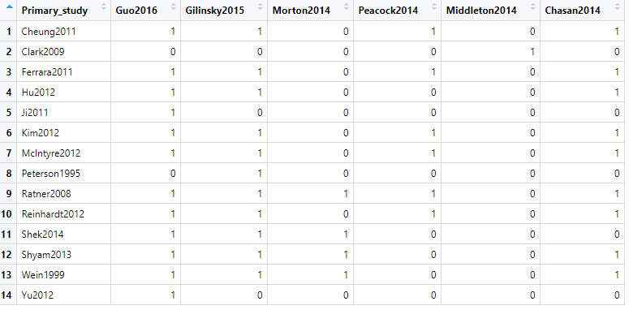
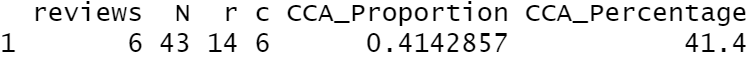
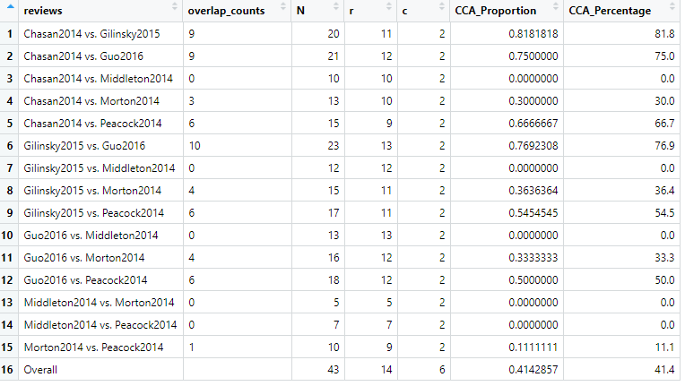
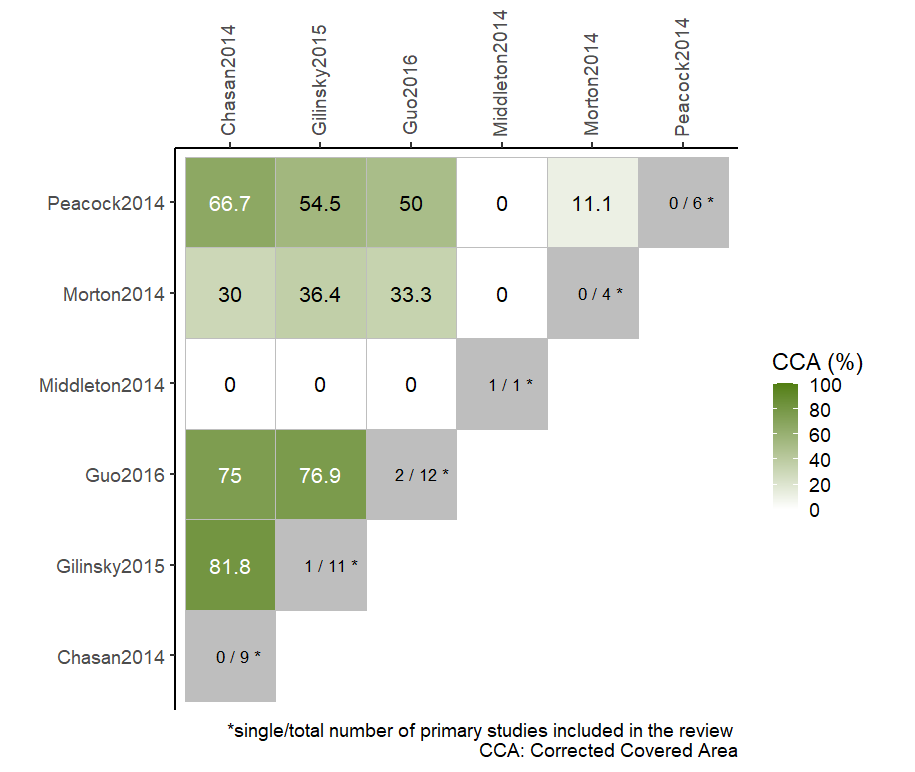

# ccaR 


## Overview

ccaR provides functions for assessing and depicting primary study overlap across multiple reviews. The functions may be useful for methodologists and overview authors in exploring and communicating the degree of overlap in overview of reviews.

<br/>

## Installation

``` r
# You can download the development version of the package from github:
devtools::install_github('thdiakon/ccaR')
```

<br/>

## Read the data

```
library(ccaR)

# Read the data
DATASET <- readr::read_delim(system.file('extdata','test.csv', package = 'ccaR'), delim = ";")
```



<br/>

## Overall CCA

```
# Calculate the overall CCA (for the entire citation matrix)
cca(DATASET)
```



<br/>

## CCA Table

```
# Create a summary table with pairwise and overall CCA 
tb <- cca_table(DATASET)
```




<br/>

## Visualization of the pairwise CCA(%) with a heatmap

```
# Create a pairwise heatmap with CCA(%)
cca_heatmap(DATASET)
```



Main characteristics:

-	the plot is highly customizable as a ggplot object

-	it uses a sequential continuous color scale 

-	it enables the incorporation of structural missingness in the citation matrix (not shown in the above figure)

-	it presents the single/total number of primary studies included in each review in the diagonal tiles (note: a single primary study is exclusively included in only one SR in an overview). For example, in the overview shown in the above figure, the study by Guo 2016 is the most recent and largest SR with 12 primary studies (two included only in this SR). Also, the only primary study included in the SR by Middleton 2014 is not included in any other review.

-	it produces publication-ready plots


<br/>

## Attribution
If package ccaR (or code from this package) is used for investigating overlap of primary studies between reviews, please cite the following manuscript:

Bougioukas KI, Vounzoulaki E, Mantsiou CD, Savvides ED, Karakosta C, Diakonidis T, et al. Methods for depicting overlap in overviews of systematic reviews: An introduction to static tabular and graphical displays. J Clin Epidemiol 2021;132:34–45. doi:https://doi.org/10.1016/j.jclinepi.2020.12.004.

